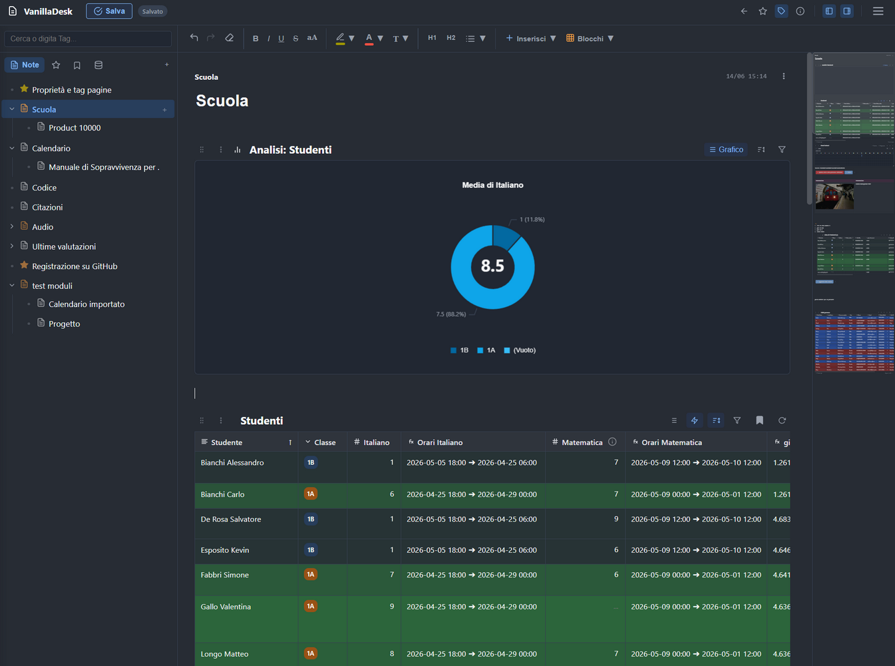
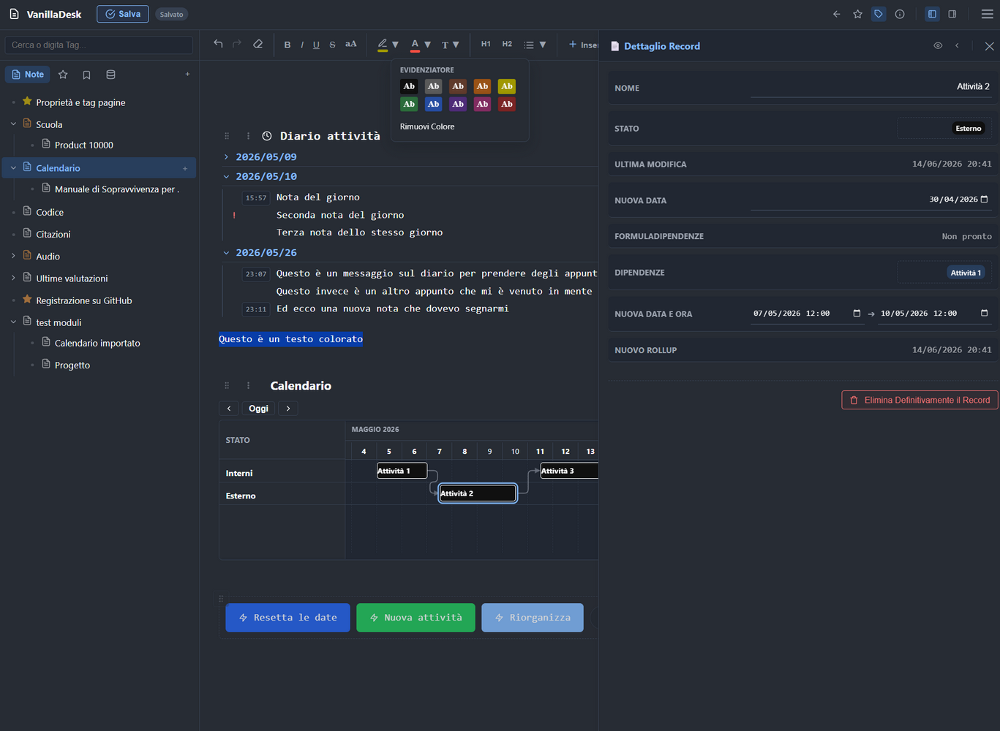
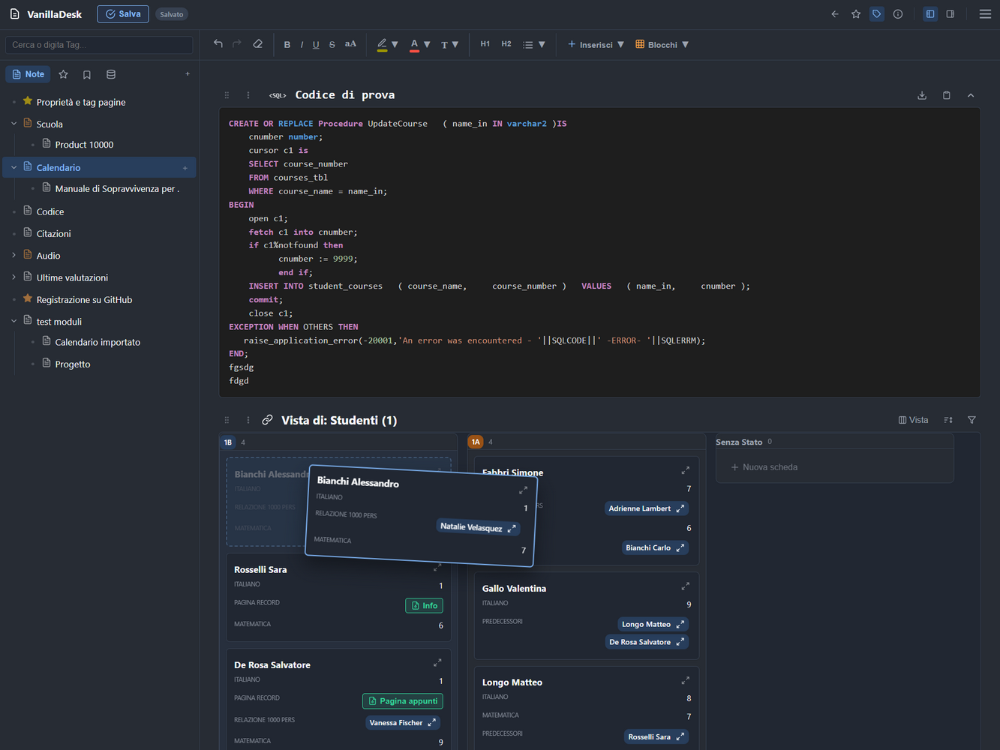

# VanillaDesk - Local-First Knowledge & Workspace Manager

VanillaDesk is not just a simple notepad. It’s a hybrid workspace that combines an **advanced WYSIWYG word processor** with a powerful **in-memory Relational Database Engine (RDBMS)**.

Everything runs at lightning speed, entirely in your browser. No servers, no clouds, no subscriptions, no dependencies (Zero NPM, No React/Vue/Angular). Just pure, solid, and blazingly fast **Vanilla JavaScript**.

## Why I Built VanillaDesk
Working as an IT professional in **AMS (Application Management Services)**, I constantly found myself managing repetitive tasks, log queries, code snippets, and fragmented documentation. I needed a tool as fast as a notepad but as powerful as a relational database, one that I could run on corporate machines without installing servers or relying on external Clouds blocked by strict firewalls. That’s how VanillaDesk was born.

## Key Features

* **100% Privacy & Local-First:** Your data never leaves your computer. The app saves everything into a local folder (Workspace) on your hard drive using the native *File System Access API*.
* **Native Relational Databases:** Turn raw data into Kanban Boards, Calendars, or Gantt Charts (Timelines) with a few clicks. Supports inter-table Relations, Rollups, and Formulas.
* **Automation Engine & Macros:** Create Triggers and Actions. Fire chain updates, trigger sound alerts, or modify hundreds of records in batch via custom programmable buttons.
* **Sandboxed JS Formulas:** A computation engine that allows you to write pure JavaScript code inside cells for complex math, string manipulation, and dynamic styling.
* **Transclusion (Live Citations):** Dynamically embed a text block or a table from another note. Edit the original, and all citations across your entire workspace update in real-time.
* **Military-Grade Encryption:** Protect your data with native WebCrypto API AES-GCM 256-bit encryption. Set a password, and the JSON saved on your disk becomes completely unreadable.
* **Crash Recovery System:** With every keystroke, the app performs a silent backup in IndexedDB. If your browser crashes or the tab is accidentally closed, your session is restored instantly.

## Architecture & Tech Stack
The engineering goal behind VanillaDesk is absolute longevity and zero technical debt from third-party frameworks.
* **Core:** HTML5, CSS3, ES6+ Vanilla JavaScript. Custom Virtual DOM and Caret Engine for Widgets.
* **Storage:** File System Access API (Disk Persistence) + IndexedDB (RAM Cache & Crash Recovery).
* **External Libraries:** The only external dependency is `Chart.js` (bundled locally in the repo) used to generate Analytic Dashboards and Pivot Charts.

## AI-Assisted Development (Pair-Programming)
To build this project, I adopted a modern AI-assisted development approach. The software architecture, business logic, in-memory database design, and overall UX are the result of my own vision and AMS background. LLM models acted as my "Co-Pilots" to accelerate boilerplate coding, optimize sorting/filtering algorithms, and refine the Vanilla CSS UI, always operating under strict, pre-defined architectural rules.

## How to Use (Zero Installation)
The application is a true serverless Single Page Application (SPA).
1. Clone or download the source code from this repository.
2. Double-click on `index.html` to open it in your browser.
3. Click on **"Create New Workspace"** to initialize your working folder on your PC.

⚠️ **Browser Compatibility:** Since VanillaDesk heavily relies on the modern *File System Access API* to physically write files to your hard drive, a Chromium-based browser is required (**Google Chrome, Microsoft Edge, Brave, Opera**). Browsers like Safari or Firefox do not yet fully support these APIs natively.

📧 **Email:** [dragoneblu@gmail.com](mailto:dragoneblu@gmail.com)

## License
This project is licensed under the **MIT License**. You are free to use, study, modify, and distribute it, even for commercial purposes. See the [LICENSE.txt](LICENSE) file for details.

---

VanillaDesk non è un semplice blocco note. È un ambiente di lavoro ibrido che unisce un **elaboratore di testi WYSIWYG avanzato** a un potente **motore di database relazionale (RDBMS) in-memory**. 

Tutto gira alla velocità della luce, direttamente nel tuo browser. Nessun server, nessun cloud, nessun abbonamento, nessuna dipendenza (Zero NPM, No React/Vue/Angular). Solo puro, solido e performante **Vanilla JavaScript**.

## Perché ho creato VanillaDesk?
Lavorando come professionista IT nel settore **AMS (Application Management Services)**, mi trovavo costantemente a gestire task ripetitivi, query di log, frammenti di codice e documentazioni frammentate. Avevo bisogno di uno strumento veloce come un blocco note, ma potente come un database relazionale, che potessi far girare sulle macchine aziendali senza dover installare server o dipendere da Cloud esterni bloccati dai firewall aziendali. Così è nato VanillaDesk.

## Caratteristiche Principali

* **100% Privacy & Local-First:** I dati non lasciano mai il tuo computer. L'app salva tutto in una cartella sul tuo disco locale (Workspace) usando la *File System Access API*.
* **Database Relazionali Nativi:** Trasforma le tabelle in Kanban (Bacheche), Calendari o Diagrammi di Gantt (Timeline) con pochi click. Supporta Relazioni tra tabelle, Rollup e Formule.
* **Motore di Automazione & Macro:** Crea Trigger e Azioni. Fai scattare aggiornamenti a catena, invia alert sonori o modifica centinaia di record in batch tramite pulsanti personalizzati.
* **Formule JS in Sandbox:** Un motore di calcolo che ti permette di scrivere puro codice Javascript all'interno delle celle per calcoli complessi e manipolazioni di stringhe/date.
* **Transclusion (Citazioni Vive):** Cita dinamicamente un blocco di testo o una tabella da un'altra nota. Se modifichi l'originale, tutte le citazioni nell'app si aggiornano in tempo reale.
* **Crittografia Militare:** Proteggi i tuoi dati con crittografia AES-GCM a 256 bit nativa (WebCrypto API). Se imposti una password, il JSON salvato su disco diventa totalmente illeggibile.
* **Crash Recovery System:** Ad ogni digitazione, l'app salva un backup silente in IndexedDB. Se il browser crasha o si chiude la finestra accidentalmente, la sessione viene ripristinata istantaneamente.

## Architettura & Tech Stack
L'obiettivo ingegneristico di VanillaDesk è la longevità assoluta e l'assenza di debito tecnico derivato da framework terzi.
* **Core:** HTML5, CSS3, ES6+ Vanilla JavaScript. Custom Virtual DOM e Caret Engine per i Widget.
* **Storage:** File System Access API (Persistenza su disco) + IndexedDB (RAM Cache & Recovery).
* **Librerie esterne:** Unica libreria esterna utilizzata è `Chart.js` (inclusa localmente nel repository) per la generazione di Dashboard Analitiche (Tabelle Pivot).

## Sviluppo AI-Assisted (Pair-Programming)
Per la stesura di questo progetto ho adottato un approccio di sviluppo moderno basato sull'Intelligenza Artificiale. L'architettura software, le regole di business, il design del database in-memory e la UX sono frutto della mia visione e della mia esperienza in ambito AMS. I modelli LLM sono stati utilizzati come "Co-Pilot" per accelerare la stesura del codice boilerplate, ottimizzare gli algoritmi di sorting/filtering e rifinire l'interfaccia utente in CSS Vanilla, operando sempre sotto rigide direttive architetturali preimpostate.

## Come usarla (Zero Installazione)
L'applicazione è una vera Single Page Application (SPA) serverless.
1. Clona o scarica il codice sorgente da questo repository.
2. Fai doppio click su `index.html` per aprirlo nel tuo browser.
3. Clicca su **"Crea Nuovo Workspace"** per inizializzare la cartella di lavoro sul tuo PC.

⚠️ **Compatibilità Browser:** Poiché VanillaDesk sfrutta la moderna *File System Access API* per scrivere fisicamente i file sul tuo hard disk, è necessario utilizzare un browser basato su Chromium (**Google Chrome, Microsoft Edge, Brave, Opera**). Browser come Safari o Firefox non supportano ancora pienamente queste API in modo nativo.

## Lavoriamo Insieme / Consulenza
Ho pubblicato questo progetto open-source per condividere uno strumento utile con altri colleghi del settore IT e per dimostrare le mie competenze architetturali e di sviluppo.

Se la tua azienda ha bisogno di un consulente, di uno sviluppatore o di un esperto per ottimizzare processi aziendali (AMS, Automazioni, Sviluppo Web), sentiti libero di contattarmi.

📧 **Email:** [dragoneblu@gmail.com](mailto:dragoneblu@gmail.com)

## Licenza
Questo progetto è rilasciato sotto licenza **MIT**. Sei libero di usarlo, studiarlo, modificarlo e distribuirlo, anche per scopi commerciali. Vedi il file [LICENSE.txt](LICENSE) per i dettagli.
